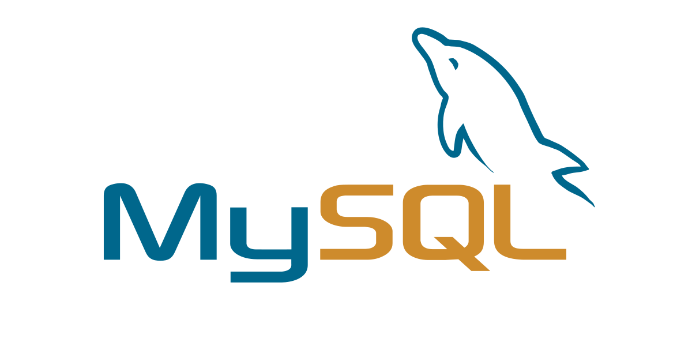

# SQL-Python

MySQL with Python
---
In this tutorial you will learn about mysql with python and be familiar with queries. 
1. connect to mysql server
2. interact with database through query
3. implement classes to choose between different database management systems like mysql and sqlite
4. copy tables between mysql and sqlite and vice versa.

